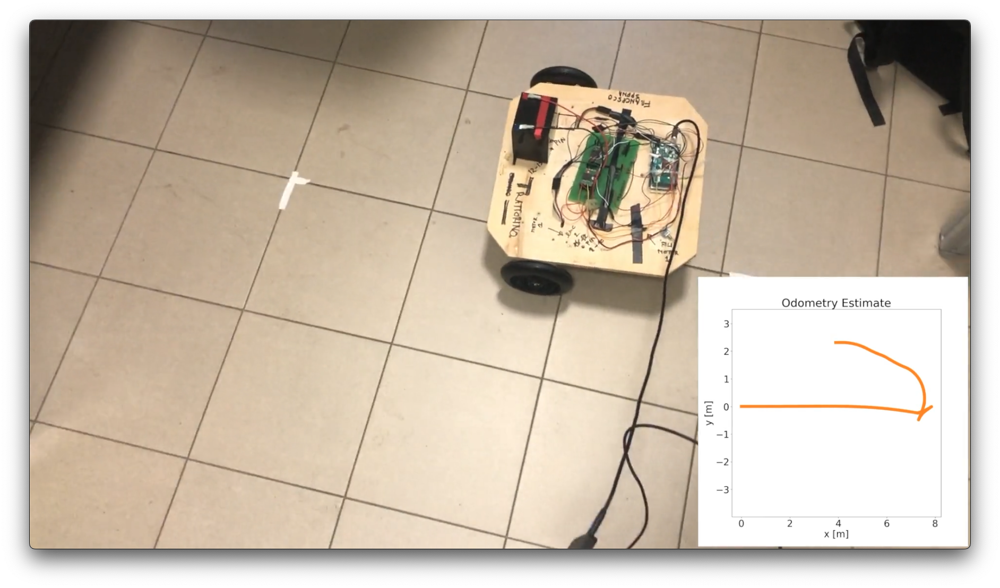
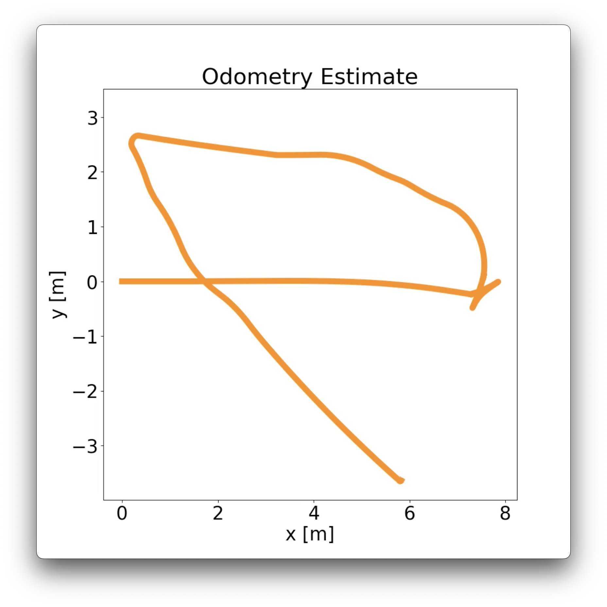
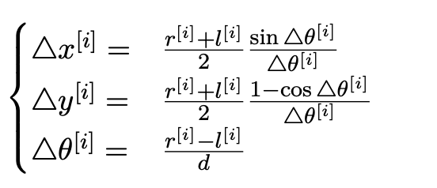
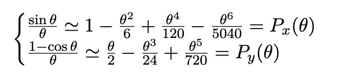
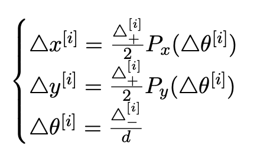
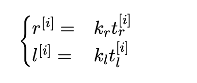

# Pose Estimation through Open-Loop Odometry (Dead Reckoning)

This project demonstrates pose estimation on a unicycle-type robot using open-loop odometry (dead reckoning). The main objective was to showcase the limitations of this method, as it lacks any feedback mechanism to correct accumulated errors. Over time, these errors grow, leading to increasingly inaccurate pose estimations, highlighting the need for more robust approaches with error correction, such as sensor fusion or closed-loop systems.

  
  

In the photos, we can see the structure of the robot and the pose estimation, respectively. In this experiment, the robot follows a square path. The estimation is accurate during the initial phase (forward movement), but as time progresses, the drift increases, causing the estimated path to deviate from the actual path and lose the ground truth shape.

## Method 

We aim to estimate the pose of the robot, described by the following equations:

  

For small angles, we can approximate this equation using a Taylor expansion, yielding:

  

We then rewrite the system in this form:

  

Where:

  

The factor k_r and k_l converts from ticks/s to m/s. This factor can be computed by knowing the motor gear ratio and the CPR (20.4:1 and 48 CPR, respectively).
## Results 

This simple project demonstrates that the method accumulates drift incrementally due to an initial error in the system setup and the absence of any feedback mechanism to compensate for it. To improve accuracy, a Kalman filter or another feedback-based approach could be implemented.

